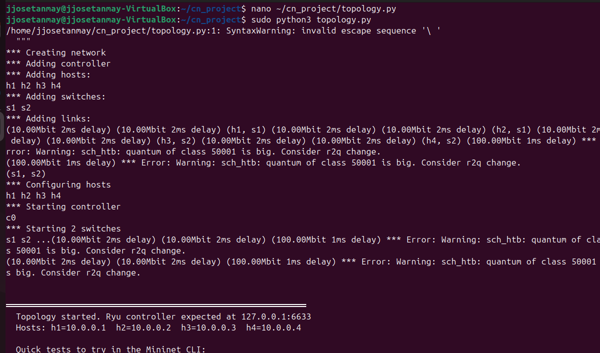
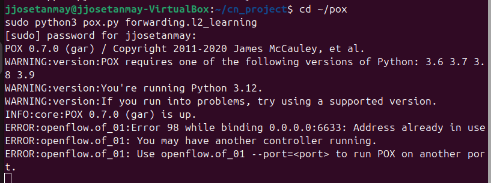
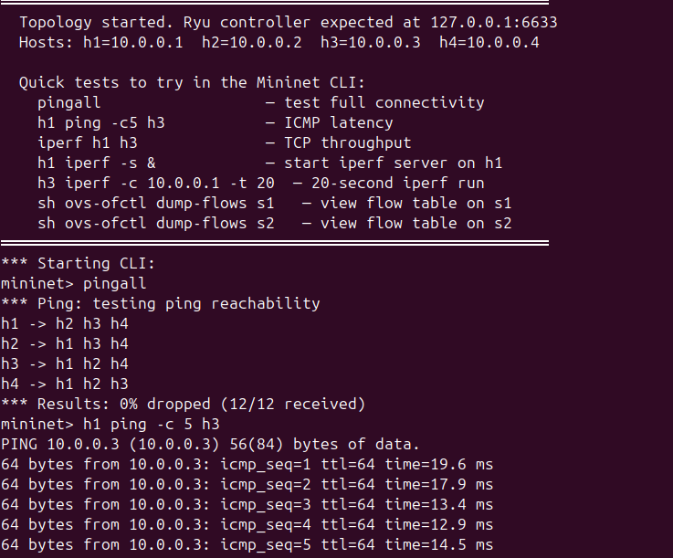
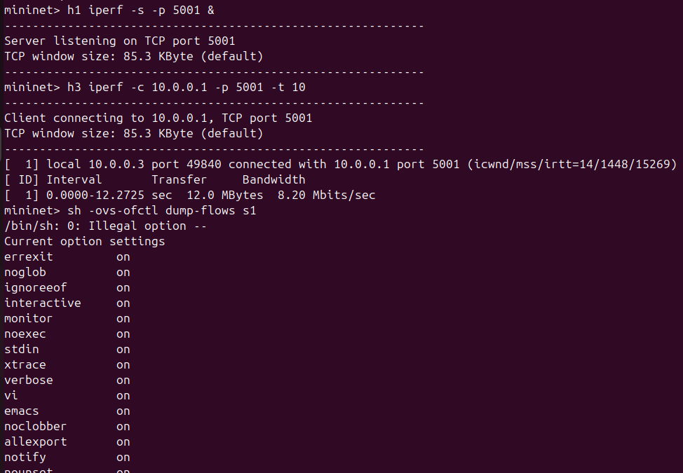
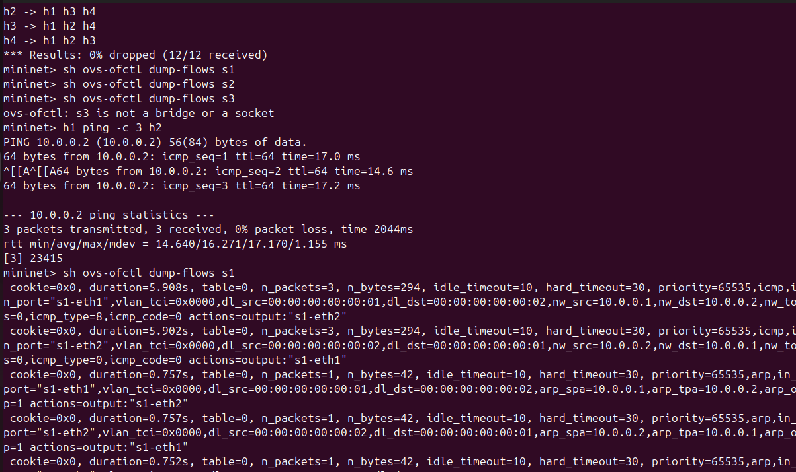
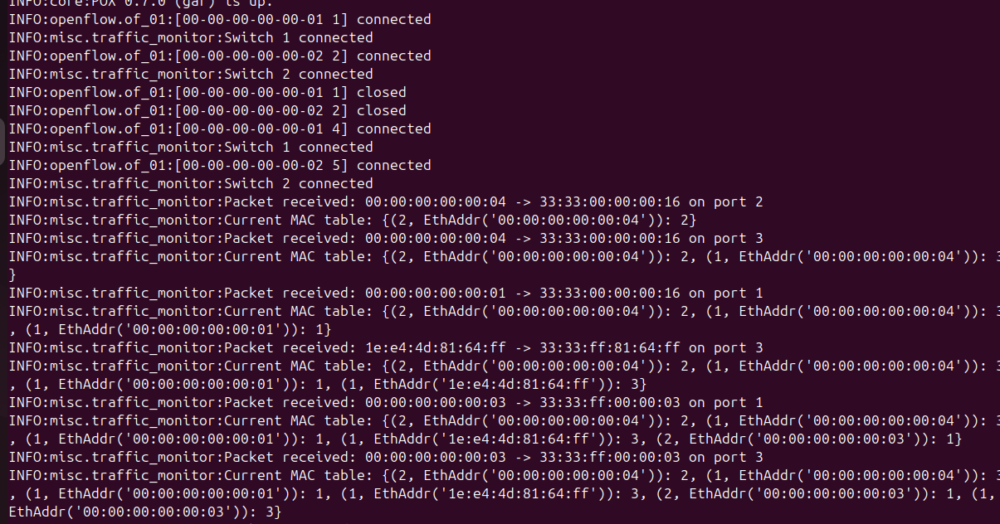

# SDN Mininet Simulation Project

## Objective

This project demonstrates Software Defined Networking (SDN) using Mininet and a POX controller. It showcases controller–switch interaction, dynamic flow rule installation using match–action logic, and network performance observation.

---

## Topology

```
        s1 -------- s2
       /  \        /  \
     h1   h2    h3   h4
```

* Access links: 10 Mbps
* Inter-switch link: 100 Mbps

This topology allows testing inter-switch communication and realistic SDN behavior.

---

## Setup & Execution

### 1. Start Controller (POX)

```
cd ~/pox
./pox.py openflow.of_01 --port=6633 forwarding.l2_learning
```

### 2. Run Mininet Topology

```
cd ~/cn_project
sudo python3 topology.py
```

---

## SDN Logic

The POX controller implements a learning switch:

* Handles `packet_in` events from switches
* Learns MAC-to-port mappings dynamically
* Installs flow rules using match–action logic
* Subsequent packets are forwarded directly by switches

This demonstrates the separation of control plane and data plane in SDN.

---

## Testing & Validation

### Connectivity Test

```
pingall
```

Result:
0% packet loss (all hosts reachable)

---

### Latency Test

```
h1 ping -c 5 h3
```

Result:
Average latency ≈ 14–17 ms

---

### Throughput Test

```
h1 iperf -s &
h3 iperf -c 10.0.0.1 -t 10
```

Result:
Throughput ≈ 8 Mbps

---

### Flow Table Inspection

```
sh ovs-ofctl -O OpenFlow10 dump-flows s1
```

Result:
Flow rules dynamically installed

---

## Performance Analysis

* Latency: ~15 ms (includes link delay and processing)
* Throughput: ~8 Mbps (limited by 10 Mbps access links)
* Flow Behavior:

  * Initially empty flow table
  * Rules installed after first packet
  * Rules expire based on timeout

---

## Results

### Topology Initialization



---

### Controller Execution



---

### Connectivity Test



---

### Performance Test



---

### Flow Table (Match–Action Rules)



---

### Traffic Monitoring (Controller Logs)



## Key Learning

* SDN separates control and data planes
* Controller dynamically installs flow rules
* Switches forward packets based on flow table entries
* Network behavior can be programmed and controlled centrally

---

## Note

The POX controller was used instead of Ryu due to compatibility issues with modern Python environments. The functionality remains equivalent for demonstrating SDN concepts.

---

## References

* Mininet Documentation
* POX Controller GitHub
* OpenFlow Specification
